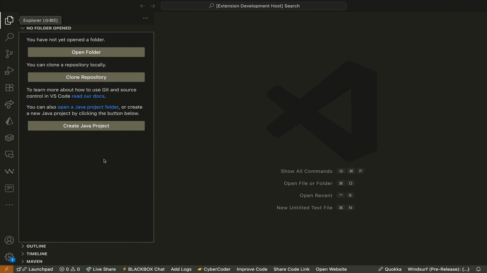

# SnipCity - Your Personal Code Snippet Companion

SnipCity is a cross-platform code snippet management system that lets you save, browse, and manage code snippets across VS Code and the web. With seamless GitHub authentication, rich snippet previews, tagging, copy-to-clipboard, and in-place editing, SnipCity makes organizing and reusing your most valuable code fragments effortless.

## Web Version

Access your snippets from anywhere using the SnipCity web app: [https://snipcity.vercel.app](https://snipcity.vercel.app)

Your snippets are synchronized across VS Code and the web, allowing you to:
- Access your snippets from any device
- Share snippets directly from the web
- Edit snippets on the go
- Preview snippets in a larger format
- Upvote/Downvote snippets
- Add comments to snippets
- Read comments on snippets

## Features

- 🔄 Infinite scroll for easy browsing of your snippets
- 📋 Snippet details and editing in a dedicated panel
- 🔐 Smart authentication flow with GitHub
- 🔍 Search and filter snippets by tags or content
- 📋 Create and edit snippets directly from VS Code
- 📋 Copy snippets to clipboard with a single click
- 📋 Rich preview of code snippets with syntax highlighting
- 📋 Organize snippets with tags and categories

## Requirements

- VS Code version 1.80.0 or higher (for the VS Code extension)
- GitHub account for authentication
- Internet connection for snippet synchronization (required for both web and VS Code versions)

## Installation

1. Open VS Code
2. Go to the Extensions view by clicking the Extensions icon in the Activity Bar on the side of the window or pressing `Ctrl+Shift+X`
3. Search for "SnipCity"
4. Click Install

## Usage

### Getting Started

1. Sign in to your GitHub account using the "SnipCity: Sign In" command or by opening the extension from the activity bar and clicking "Sign in" at the top right corner
2. Create your first snippet using the "SnipCity: Create Snippet" command or by opening the extension from the activity bar and clicking the "+Add" button
3. View all your snippets using the "SnipCity: View Snippets" command or by opening the extension from the activity bar.

### Commands

- `SnipCity: Sign In` - Authenticate with GitHub
- `SnipCity: Create Snippet` - Create a new code snippet
- `SnipCity: View Snippets` - Open the snippet browser
- `SnipCity: Force Open Sidebar` - Force open the SnipCity sidebar

<!-- ## Extension Settings

This extension contributes the following settings:

- `snippit.signIn`: Sign in to GitHub
- `snippit.createSnippet`: Create a new snippet
- `snippit.viewSnippets`: View all snippets
- `snippit.forceOpenSidebar`: Force open the sidebar -->

## Known Issues

- Currently, the extension requires an active internet connection to sync snippets
- Large snippet collections may take longer to load initially

## Release Notes

### 0.0.5
- Initial release with core functionality
- GitHub authentication
- Snippet creation and browsing
- Basic snippet management

## Contributing

1. Fork the repository
2. Create a feature branch
3. Commit your changes
4. Push to the branch
5. Create a Pull Request

<!-- ## License

This extension is licensed under the MIT License - see the LICENSE file for details. -->

## Support

For support, please:
1. Check the [issues](https://github.com/johndiddles/snipcity/issues) page
2. Create a new issue if your problem isn't listed
3. Include as much detail as possible about the issue

## Acknowledgments

- Thanks to the VS Code team for creating such an amazing platform
- Special thanks to all contributors and users who help make this extension better
